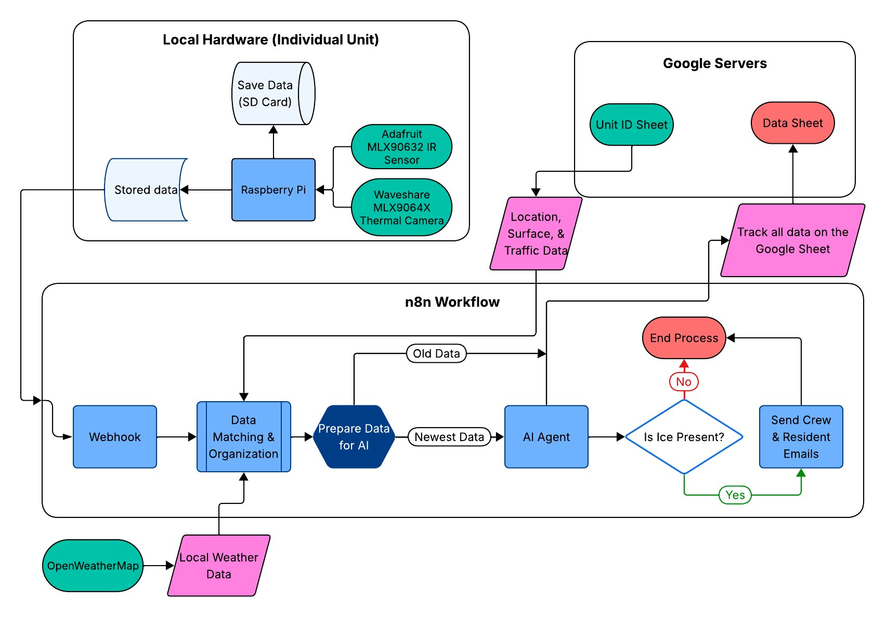

# CitySense Ice Detector
Compact, deployable surface ice detection system with thermal sensing and imaging, sensor logging, and live updates  
ENGR 100:190 Final Project *– Matt Hall, Lucas Wells, Clara James-Heer, Lily McCreedy*

### Attention:
If you're reading this after downloading the archive onto a fresh Raspberry Pi OS, you can skip to [Sensor Server](#sensor-server)

## Project Details
All project information including our research, project proposal, and design choices can be found on my [website](https://hallmattdr.wixsite.com/home/ice-detector). This document will focus on the hardware requirements and code for the device.

## Hardware Requirements
This code is designed to work specifically with the hardware we chose for our prototype. We specifically picked parts with budget considerations and compatibility in mind.
* Embedded System: [RaspberryPi 3 Model B](https://www.raspberrypi.com/products/raspberry-pi-3-model-b/)
* Thermal Camera: [Waveshare MLX90641](https://www.waveshare.com/mlx90641-d55-thermal-camera.htm)
* IR Sensor: [Adafruit MLX90632](https://www.adafruit.com/product/6403)
   * I also recommend a STEMMA QT Qwiic cable to make easy connections to the breadboard. Adafruit sells [single cables](https://www.adafruit.com/product/4209), or you can puchase a set of cables from [Amazon](https://www.amazon.com/dp/B08HQ1VSVL)
* Basic Breadboard
* Various Breadboard Wires
* Micro-SD Card for Raspberri Pi OS: [SanDisk 32GB](https://www.amazon.com/SanDisk-Ultra%C2%AE-microSDHC-120MB-Class/dp/B08L5HMJVW/ref=sr_1_8?crid=2JL0BG9U393CC&dib=eyJ2IjoiMSJ9.yrP4UaR9Qm2nBvVQHjgYJHmGdvUwh-8r5OpA8qYWNfnFdDn1qkv5REyGd3JC9NAYodBGoqPSaUlhAN0OiIk6lsZ0a5K24iVhL4A1j2qkDlAhOVbo1FiOnRS1Ar-hsQEyN54Rw0nvHceXx44prIXxhDdO127cIRFmjM3YmZExjegSOOnwQmfG4B_vPZ7C4ZTEUXSJCoRR3LJCs6fH5ORYaBC3knjsVea-7JTaE_W1epY.DR6W6QCN-kNh00_Dpa8vWEjROWIbbWN1L9Inj65hXcc&dib_tag=se&keywords=sandisk%2Bmicro%2Bsd%2Bcard&qid=1771350585&sprefix=sandisk%2Bmicro%2Bsd%2Bcar%2Caps%2C147&sr=8-8&th=1)

Our prototype used a tupperware container for the enclosure, but anything somewhat weather-proof could work.
Additionally, you'll need a portable charger. The Raspberry Pi is a very efficient system, so you can get away with a small capacity portable charger. We got 10+ hours out of a 6000mAh portable charger.

### Wiring Layout
The both sensors need to be connected over I2C. To achieve this, connect the Raspberry Pi's 5V, Ground, SDA, and SCL wires to locations on the breadboard. Then, both the IR sensor and thermal camera all have those 4 connections, and you just need to wire each respective connection in series with the connections from the Raspberry Pi.  
You can verify your wiring is correct with the terminal once the Raspberry Pi is configured.

## Software Architecture

### Raspberry Pi Configuration
To get the Raspberry Pi up and running, you will need to image your Micro-SD card with a Raspberry Pi OS installation. Make sure you have some way to write to the Micro-SD card from your computer.

#### Raspberry Pi OS Imaging
1. On your computer, download the [Raspberry Pi Imager](https://www.raspberrypi.com/software/)
2. Insert your Micro-SD card to your computer, and open the imager. You should see steps to setup device model, OS, storage device, customization, and writing
   1. Select whichever Raspberry Pi model you are using (this prototype uses a **Model 3** B)
   2. Choose **Raspberry Pi OS (64 bit)** (You can also use Raspberry Pi OS Lite (64 bit) if you are comfortable with only using the terminal, but I prefer having desktop access just in case)
   3. Select your Micro-SD Card in the Storage menu. **WARNING: Do not continue unless you are sure you picked the correct storage device!** If you pick the wrong device it will erase all currently stored data. If you aren't sure, disconnect all other storage devices besides the SD card
   4. Choose a short and memoroable hostname for your device. For example, I set mine to *mattpi*
   5. Configure localization settings for your area including time zone and keyboard layout
   6. Configure a username and password for your device. **WARNING: Make sure to save the password somewhere!** If you forget it, there is no way to recover the device without re-flashing the SD card
   7. Configure wireless LAN settings for your network. That way when you power on your Pi, you can remotely connect to it over WiFi
   8. Skip SSH authentication and Raspberry Pi Connect unless you need those. We'll be using a VNC server instead
3. With those settings configured, **click write** to write the configuration to the drive. The next menu is a warning that all existing data will be erased. If you confirmed that this is the correct storage device, **click I UNDERSTAND, ERASE AND WRITE**

#### Setting Up a Remote Connection
The easiest way to remotely access the GUI of the Raspberry Pi from a client PC is with a VNC. I found [TigerVNC](https://tigervnc.org/) very easy to use. It looks like Raspberry Pi [has their own remote desktop software](https://www.raspberrypi.com/software/connect/), but I have not tested it.  
In order to remote desktop, however, you will need to initially connect the Raspberry Pi to a keyboard, mouse, and monitor to configure VNC and get its IP address
* Insert the Micro-SD card you just flashed into the port on the bottom of the Raspberry Pi, connect a keyboard, mouse, and monitor, and plug the Pi into power
* Once the startup is complete, you'll be brought to the desktop. First, ensure it properly connected to your network. Otherwise, connect to your local network now
* Open the terminal, and enter `ifconfig`. Scroll to find `wlan0` and locate the number next to `inet`. It should look like 192.168.X.XXX. Save this address, this is how you'll connect to the Pi
* Enter `sudo raspi-config` – this will open the configuration tool. Open option 3: "Interface Options." Enable the **VNC** and **I2C** options
* Enter `sudo reboot` and let the Pi restart
* On your client PC, open TigerVNC. Once the Pi has restarted, enter the IP address that you saved before, and click **connect**. Select **yes** for any confirmations that appear, and enter the username and password that you configured for your Pi, then click **OK**. A new window should open with a remote connection to your desktop
* Now you can disconnect the monitor and peripherals from your Pi, and use this remote connection to work from your client PC

#### Final Preparation
* Create a folder on the Raspberry Pi desktop to hold your files and data
* Download the latest release of the [sensor server archive files](https://github.com/hallmattdr/citysense-icedetector/releases) **onto your Raspberry Pi**. Extract it into the folder you created
* Now we can verify that your sensors are wired correctly
   * Open a terminal on the Pi
   * Enter these commands:
     * `sudo apt update`
     * `apt install -y i2c-tools`
     * `sudo i2cdetect -y 1`
   * This prints out a table of available hex address, most of which should be "--". Somewhere on the table you should see the addresses `0x3A` and `0x33`
   * If you see those, you're all set to move on. If not, you need to verify your wiring is correct before you move forward

### Sensor Server

### n8n Integration
The real power of this program is its integration with workflow automation system *n8n*.
### System Architecture Diagram
